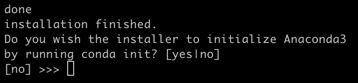

# 注意事项
1.GPU服务器 (宿主机) 采用Docker来实现对计算资源的共享和对用户之间的隔离. 管理员使用Docker为每一位用户开启一个容器(可以理解为Ubuntu虚拟机),
每位用户使用ssh连接到分配给自己的容器, 即可开始使用.

2.容器本质为一个小型Ubuntu 20.04系统(无GUI), 在其上安装了11.3的CUDA, 8.2.0的cuDNN. 若确需使用不同版本的CUDA, 请联系管理员.

3.登入容器中的Ubuntu系统, 默认使用的是root账户, 其用户文件夹为/root. 请将自己的项目(包括程序代码, 数据集等文件)统一放在/root文件夹下.
因为管理员将容器中/root文件夹挂载到了宿主机文件系统上, 即使容器被删除后, /root文件夹里的内容也不会丢失.
请注意: (1)每次使用ssh登录进自己的容器的时候, 当前所在目录即为/root,可通过```pwd```命令查看当前所在目录.
(2)Linux中, ~的含义是当前用户的用户文件夹, 对于root用户而言, 用户文件夹即为/root.

4.可通过```nvidia-smi```命令查看GPU显存占用, GPU利用率等.
```nvidia-smi```命令返回信息的含义请自行查阅[这个链接](https://www.jianshu.com/p/ceb3c020e06b).

5.如果有用户在容器内使用Tensorboard, 请知会其端口从6006映射到了宿主机的1xxxx(xxxx为用户学号后4位).如果有用户在容器内使用JupyterLab, 请知会其端口从8889映射到了宿主机的2xxxx(xxxx为用户学号后4位).

# 进入容器 更改密码
1.进入 [Xshell官网](https://www.netsarang.com/zh/free-for-home-school/) 填上姓名与邮件, 下载免费的Xshell和Xftp.

2.在Xshell中输入分配给你的IP地址和端口, 连接后输入用户名: root和初始密码: root后即可进入容器.

3.输入passwd指令, 更换初始密码, 请牢记密码.


# 添加CUDA环境变量
1.输入命令```vim ~/.bashrc```, 对本文件进行编辑: 按i键进行编辑, 写入如下两行:
```
export PATH=/usr/local/cuda/bin${PATH:+:${PATH}}
export LD_LIBRARY_PATH=/usr/local/cuda/lib64${LD_LIBRARY_PATH:+:${LD_LIBRARY_PATH}}
```
然后按Esc退出编辑, 再输入```:wq```保存并退出. 退出后再输入```source ~/.bashrc```命令. 输入```nvcc -V```命令，如果能够成功输出CUDA版本信息，本步骤即为成功。


# 更换Ubuntu软件源
1.输入命令```vim /etc/apt/sources.list```, 进入文件后, 直接输入```gg```, 此时光标会跳到文件开头, 再输入```dG```, 即可清空所有文字, 再按i键进行编辑, 写入[Ubuntu 镜像](https://developer.aliyun.com/mirror/ubuntu?spm=a2c6h.13651102.0.0.52401b11qLxeix)页面中ubuntu 20.04(focal)的源配置文件. 然后Esc退出编辑, 再输入```:wq```保存并退出. 退出后再输入```apt-get update```命令.


# 安装Anaconda 更换Conda源
1.输入```wget -c https://mirrors.tuna.tsinghua.edu.cn/anaconda/archive/Anaconda3-2021.11-Linux-x86_64.sh```,
下载完成后, 输入```chmod +x Anaconda3-2021.11-Linux-x86_64.sh```, 再输入```bash Anaconda3-2021.11-Linux-x86_64.sh```开始安装.

2.首先一直按着Enter阅读用户协议, 读完后输入yes即可. 输入完yes后, 询问你要不要改变安装路径, 这里不需要改变路径, 安装在/root文件夹即可. 按回车即可开始安装, 如下图:  
  
安装完毕后, 询问你要不要进行conda初始化, 输入yes.  
  
完成以后, 输入```source ~/.bashrc```命令, 此时应该就已经激活了base环境.

3.更换conda源为清华源: 首先执行```conda config --set show_channel_urls yes```, 再输入```vim ~/.condarc```, 按i键进行编辑, 将[Anaconda 镜像使用帮助](https://mirror.tuna.tsinghua.edu.cn/help/anaconda/)页面中的源配置文件粘贴进去, 然后Esc再```:wq```保存并退出.退出后, 执行一下```conda clean -i```命令清除索引缓存.

### 4.每次用户使用完毕容器并退出, 等再次使用ssh连接自己的容器时, conda命令会找不到, 每次都如此.
### 这个问题和ssh连接容器有关. 每次进入容器后, 通过输入```source ~/.bashrc```命令即可解决问题.

# 创建Python环境与安装Pytorch
创建环境: ```conda create -n torchenv```, 进入环境: ```conda activate torchenv```,
安装Pytorch: ```conda install pytorch torchvision torchaudio cudatoolkit=11.3 -c pytorch```.

# 使用完毕
使用完毕后, 输入```exit```或者```logout```命令退出容器即可.

# 更换容器
若自己的容器出现错误, 联系管理员, 管理员删除旧容器, 并新建新容器分配于你后, 一般只需要重新执行本教程的"输入passwd指令, 更换初始密码", "更换Ubuntu软件源"这两个步骤即可. 旧容器的Anaconda, conda环境, 项目, 代码, 数据集等都仍旧存在. 因为管理员将每个容器的/root文件夹挂载到了宿主机文件系统上, 删除旧容器不会删除/root文件夹下的内容. 当新建新容器时, 管理员会将新容器的/root文件夹重新挂载到宿主机文件系统上旧容器的/root文件夹的位置, 所以旧有数据仍然会保留.
